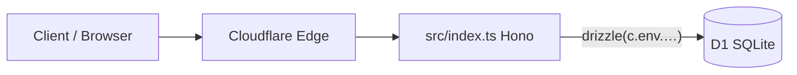

# 01 — Tổng quan dự án

## Mục tiêu

**moithue-base** là một Worker chạy trên [Cloudflare Workers](https://developers.cloudflare.com/workers/), cung cấp:

1. **API REST** (framework [Hono](https://hono.dev/)) với tiền tố đường dẫn `/api/v1`.
2. **Lưu trữ dữ liệu** qua [D1](https://developers.cloudflare.com/d1/) (SQLite phân tán), truy cập bằng [Drizzle ORM](https://orm.drizzle.team/).
3. **Tài nguyên tĩnh** (thư mục `public/`) phục vụ qua cấu hình `assets` trong Wrangler — ví dụ `index.html` tại `/`.

## Stack kỹ thuật

| Thành phần | Vai trò |
|------------|---------|
| **TypeScript** | Ngôn ngữ chính (`tsconfig.json`, target ES2024). |
| **Hono** | Router + handler HTTP, JSON body, tham số động `:id`. |
| **Drizzle ORM** | Định nghĩa schema, query type-safe, sinh SQL migration. |
| **Cloudflare D1** | Database SQLite; binding kiểu `D1Database` trong `Env`. |
| **Wrangler** | Build, dev local, deploy, `d1 execute`, `types`. |
| **Drizzle Kit** | `generate` / `migrate` / `studio` theo `drizzle.config.ts`. |
| **Vitest + @cloudflare/vitest-pool-workers** | Test Worker (file trong `test/`). |

## Luồng request điển hình

- Request tới **`/api/v1/...`**: do Hono xử lý (Worker).
- Request tới **`/`** hoặc file tĩnh khác: Wrangler có thể phục vụ từ `public/` tùy cách routing Workers + assets (theo tài liệu Cloudflare cho bản Workers + static assets bạn đang dùng).

## Phạm vi nghiệp vụ (domain)

Ứng dụng mẫu quản lý **users → posts → comments**:

- Một **user** có nhiều **post**; mỗi **post** có nhiều **comment**; **comment** gắn cả `user_id` (người viết) và `post_id`.

Chi tiết endpoint nằm trong [04-worker-api-hono.md](./04-worker-api-hono.md); mô hình dữ liệu trong [05-co-so-du-lieu-drizzle-d1.md](./05-co-so-du-lieu-drizzle-d1.md).

## Ghi chú về tính nhất quán trong repo

Một số file (test, `public/index.html`) vẫn tham chiếu route **`/message`**, **`/random`** — không khớp với API Hono hiện tại chỉ mount tại **`/api/v1`**. Khi vận hành hoặc viết test mới, nên thống nhất routing và binding D1 (xem [03-cau-hinh-cloudflare-wrangler.md](./03-cau-hinh-cloudflare-wrangler.md) và [07-tai-nguyen-tinh-va-kiem-thu.md](./07-tai-nguyen-tinh-va-kiem-thu.md)).
